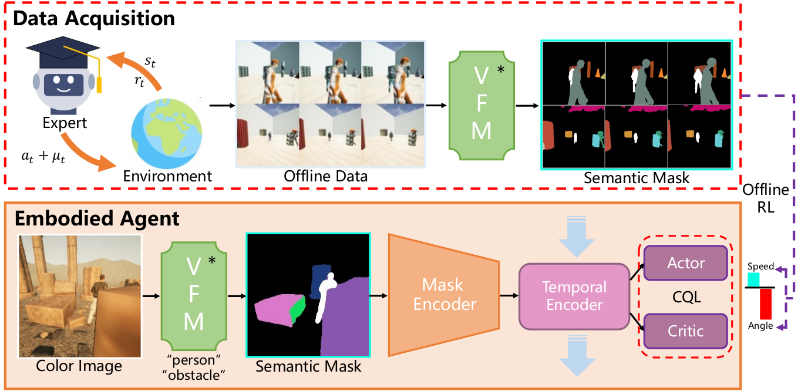

# Empowering Embodied Visual Tracking with Visual Foundation Models and Offline RL

  

[FangWei Zhong](https://fangweizhong.xyz/), [Kui Wu](), [Hai Ci](), [Chu-ran Wang ](), [Hao Chen]()

Peking University, BeiHang University, National University of Singapore and The Hong Kong Polytechnic University.

ECCV 2024

[[arXiV]](https://arxiv.org/abs/2404.09857)  [[Project Page]](https://sites.google.com/d/1TlnjsKbF2IgvdM9-aMJLShlnVBlS9ttN/p/1NZNTU2LmzgeXYYwuFn4w4r9pZaw-gdYN/edit?pli=1)  

## Installation
Our model rely on the DEVA as the vision foundation model and Gym-Unrealcv as the evaluation environment, which requires to install three additional packages: Grounded-Segment-Anything, DEVA and Gym-Unrealcv. Note that we modified the original DEVA to adapt to our task, we provide the modified version in the repository.
**Prerequisite:**
- Python 3.9
- PyTorch 2.1.1 and corresponding torchvision
- gym_unrealcv(https://github.com/zfw1226/gym-unrealcv)
- Grounded-Segment-Anything (https://github.com/hkchengrex/Grounded-Segment-Anything)
- DEVA (https://github.com/hkchengrex/Tracking-Anything-with-DEVA)

**Clone our repository:**
```bash
git clone https://github.com/wukui-muc/Offline_RL_Active_Tracking.git
```

**Install Grounded-Segment-Anything:**  
You should set the environment variable manually as follows if you want to build a local GPU environment for Grounded-SAM:
```bash
cd Offline_RL_Active_Tracking
git clone https://github.com/hkchengrex/Grounded-Segment-Anything

export AM_I_DOCKER=False
export BUILD_WITH_CUDA=True
export CUDA_HOME=/path/to/cuda/

cd Grounded-Segment-Anything
python -m pip install -e segment_anything
python -m pip install -e GroundingDINO
pip install --upgrade diffusers[torch]
```
**Install DEVA:**  
Directly install the modified DEVA in the repository  
(If you encounter the `File "setup.py" not found` error, upgrade your pip with `pip install --upgrade pip`)
```bash
cd .. # go back to the root directory
cd Tracking-Anything-with-DEVA
pip install -e .
bash scripts/download_models.sh #download the pretrained models
```

**Install Gym-Unrealcv:**
```bash
cd ..
git clone https://github.com/zfw1226/gym-unrealcv.git
cd gym-unrealcv
pip install -e .
```
Before running the environments, you need to prepare unreal binaries. You can load them from clouds by running load_env.py
```bash
python load_env.py -e {ENV_NAME}

# To run the demo evaluation script, you need to load the UrbanCityMulti environment and textures by running:
python load_env.py -e UrbanCityMulti
python load_env.py -e Textures
sudo chmod -R 777 ./   #solve the permission problem
```

## Quick Start

### Evaluation

```bash
python Eval_tracking_agent.py --env UnrealTrackGeneral-UrbanCity-ContinuousColor-v0 --chunk_size 1 --amp --min_mid_term_frames 5 --max_mid_term_frames 10 --detection_every 20 --prompt person.obstacles 
```

### Training

```bash
python train_offline --buffer_path {Data-Path}
```


## Citation

```bibtex

```

## References

Thanks for the previous works that we build upon:  
DEVA: https://github.com/hkchengrex/Tracking-Anything-with-DEVA  
Grounded Segment Anything: https://github.com/IDEA-Research/Grounded-Segment-Anything  
Segment Anything: https://github.com/facebookresearch/segment-anything  
XMem: https://github.com/hkchengrex/XMem  
Title card generated with OpenPano: https://github.com/ppwwyyxx/OpenPano

